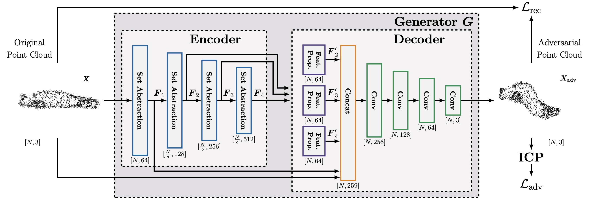

I am a first-year PhD student at the [GrUVi Lab](https://gruvi.cs.sfu.ca/) at Simon Fraser University, advised by [Prof. Xue Bin (Jason) Peng](https://xbpeng.github.io/). My research is in computer graphics. Previously, I received a B.A.Sc degree in Computer Engineering from University of Toronto.

## Research

  <!-- Row 1 -->
  
  

    <b><em>Prepared for the Worst: </em>Resilience Analysis of the ICP Algorithm via Learning-Based Worst-Case Adversarial Attacks</b> 
    <b>Ziyu Zhang</b>, Johann Laconte, Daniil Lisus, Timothy D. Barfoot 
    <em>to appear at ICRA 2025</em> 
    [<a href="https://arxiv.org/abs/2403.05666">ArXiv</a>]
  

  <!-- Row 2 -->
  
  

    <b><em>Pointing the Way: </em>Refining Radar-Lidar Localization Using Learned ICP Weights</b> 
    Daniil Lisus, Johann Laconte, Keenan Burnett, <b>Ziyu Zhang</b>, Timothy D. Barfoot 
    [<a href="https://arxiv.org/abs/2309.08731">ArXiv</a>] [<a href="https://github.com/utiasASRL/mm_masking">Code</a>]
  

  <!-- Row 3 -->
  
  

    <b>Method and a System for Generating Training Data for Training a Motion Planner</b> 
    Elmahgiubi, M., <b>Zhang, Z.</b>, Rezaee, K 
    Patent filing since 2023
  

